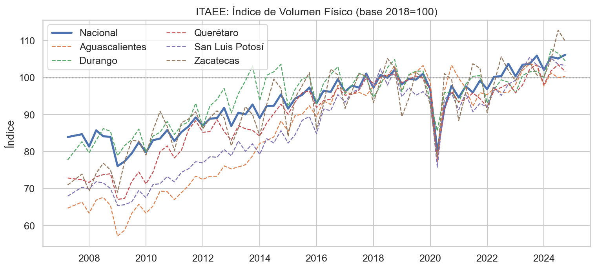
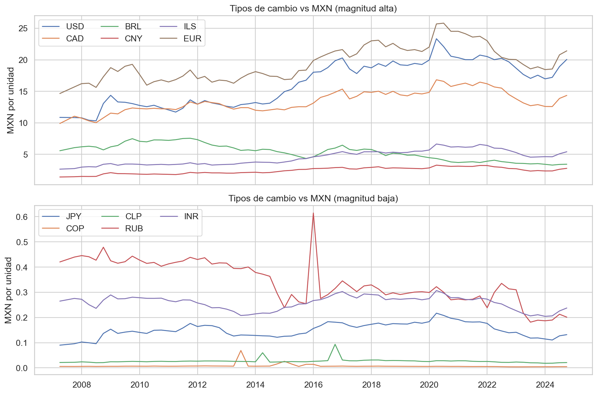
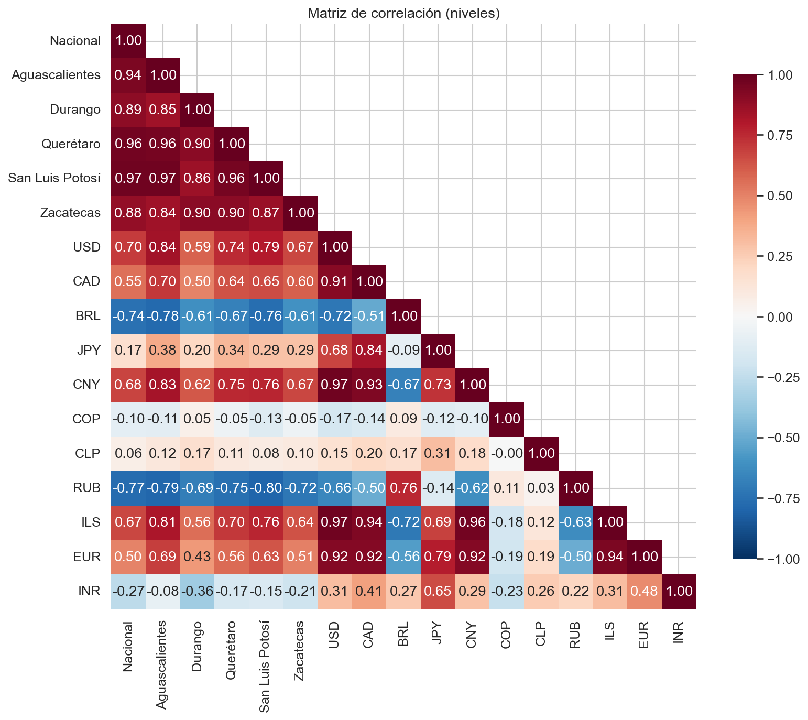
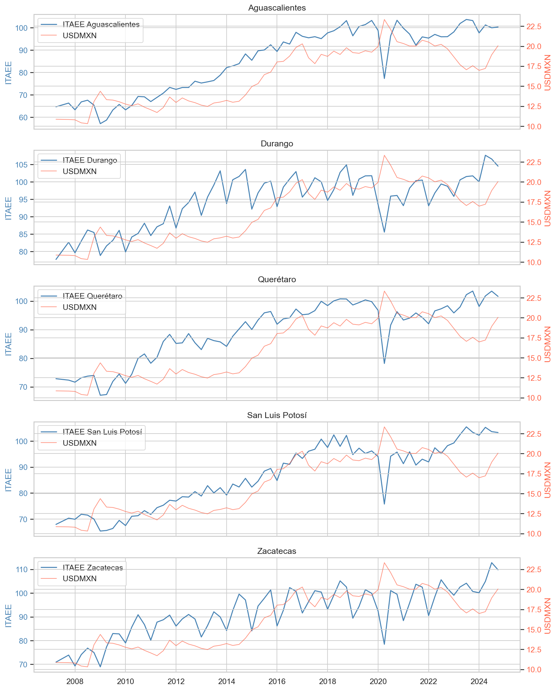
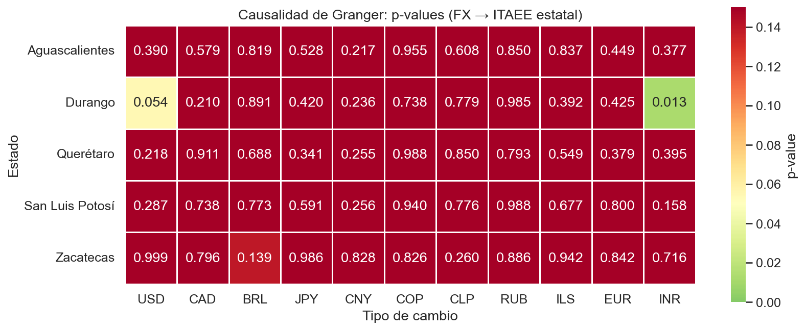
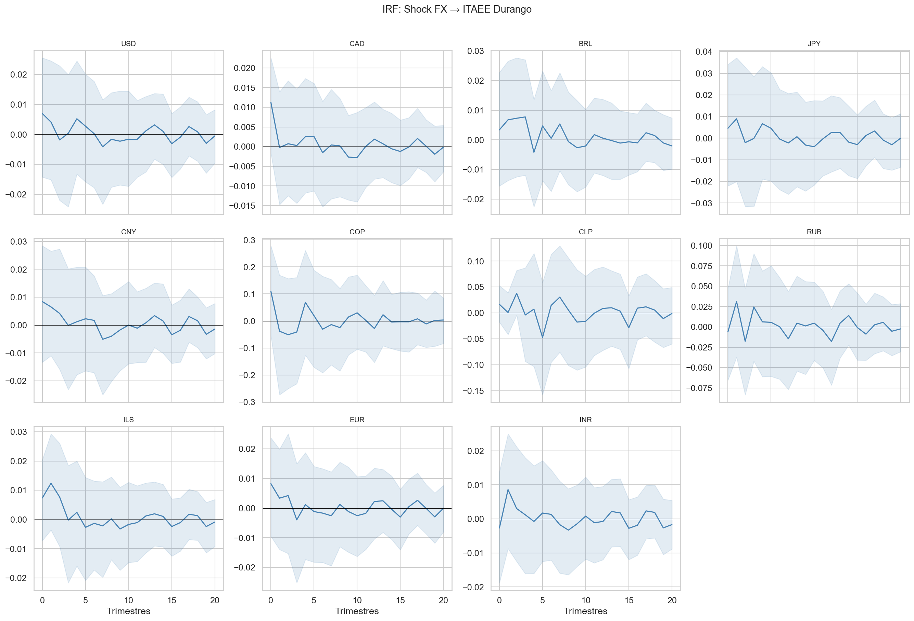
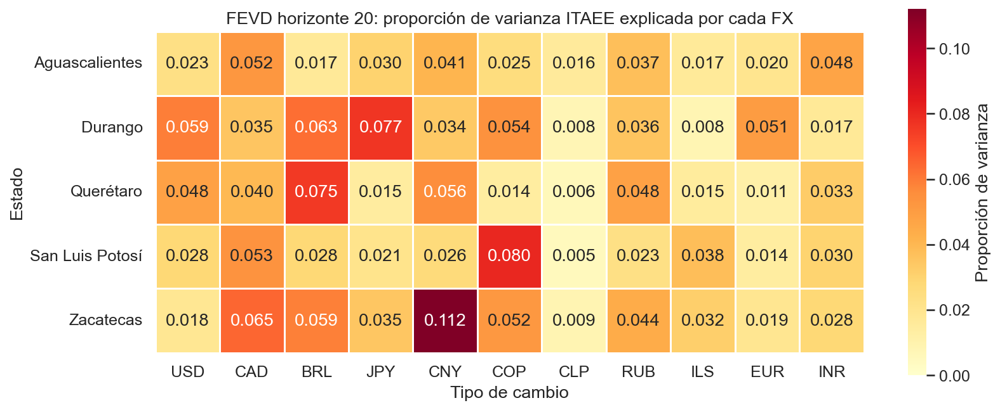
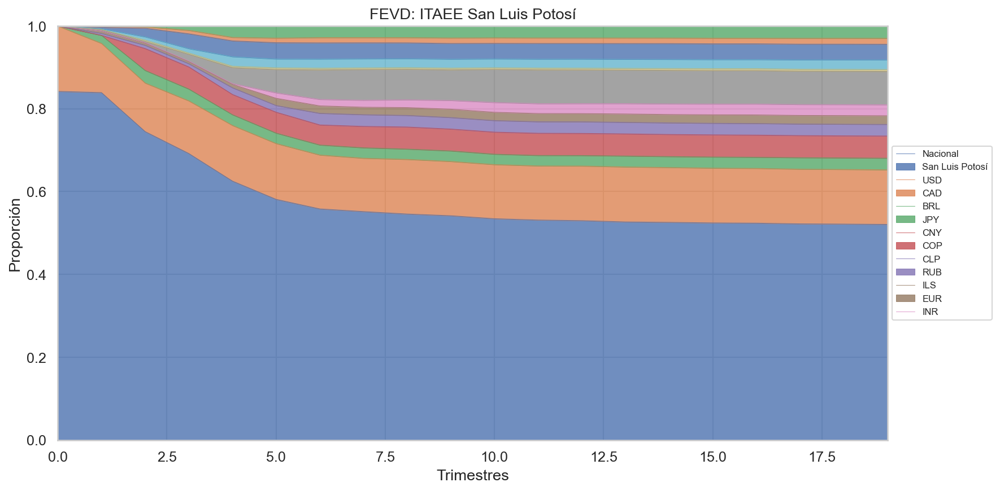

# Tipo de cambio y actividad económica estatal en México: un análisis VAR para estados de la región centro-norte

## 1. Introducción

La relación entre el tipo de cambio y la actividad económica regional constituye un tema de creciente interés en la literatura de economía internacional y regional. En México, la liberalización comercial y la integración a cadenas globales de valor han profundizado la exposición de las economías estatales a las fluctuaciones cambiarias. Sin embargo, la transmisión de los choques cambiarios hacia la actividad productiva no es homogénea entre regiones ni entre monedas, lo que plantea interrogantes relevantes para el diseño de política económica.

La literatura sobre el traspaso del tipo de cambio (*exchange rate pass-through*) ha documentado diferencias significativas en la respuesta de precios y actividad a nivel regional dentro de México. Solórzano (2023), utilizando microdatos del índice de precios al consumidor de 2002 a 2010, demuestra que las tasas de traspaso difieren considerablemente entre regiones e industrias: las regiones de bajo traspaso exhiben apenas una cuarta parte de la elasticidad de las regiones de alto traspaso después de doce meses. Esta heterogeneidad obedece a factores como las condiciones de demanda, el desarrollo económico, la distancia a la frontera con Estados Unidos, la intensidad importadora y la densidad de mercado, lo que confirma las teorías de fijación de precios por mercado (*pricing-to-market*).

En una línea similar, Saucedo y González (2020) analizan el efecto traspaso del tipo de cambio al índice de precios al consumidor en ciudades fronterizas y no fronterizas de México mediante modelos VAR. Sus resultados para el periodo 2002-2016 indican que las variaciones cambiarias afectan con mayor intensidad a las ciudades fronterizas, y que los valores de traspaso se incrementan a partir de 2017 con la liberalización de los precios de la gasolina.

A nivel internacional, Barnichon, Matthes y Ziegenbein (2019) explotan las diferencias entre estados de Estados Unidos en términos de su exposición comercial para estudiar los efectos de variaciones cambiarias sobre la actividad económica. Sus hallazgos muestran que una depreciación del tipo de cambio real ponderado por comercio se asocia con un aumento en exportaciones, una reducción del desempleo y un incremento en las horas trabajadas, con efectos particularmente fuertes en periodos de holgura económica.

En el contexto mexicano, la importancia económica creciente de las ciudades medias añade una dimensión relevante al análisis. García Meza, Valderrama Santibáñez y Neme Castillo (2020) documentan que las ciudades de tamaño medio de población han ganado peso económico relativo superior al de cualquier otro tipo de aglomeración urbana en México. Los cinco estados aquí analizados —Aguascalientes, Durango, Querétaro, San Luis Potosí y Zacatecas— pertenecen a la región centro-norte del país e incluyen capitales estatales que encajan en esta categoría de ciudades medias con creciente relevancia económica.

El presente capítulo contribuye a la discusión al analizar directamente la relación entre tipos de cambio bilaterales de 11 divisas con respecto al peso mexicano y la actividad económica estatal medida por el Indicador Trimestral de Actividad Económica Estatal (ITAEE) del INEGI, mediante modelos de Vectores Autorregresivos (VAR). El enfoque permite examinar no solo la causalidad en el sentido de Granger, sino también las funciones de impulso-respuesta y la descomposición de la varianza del error de pronóstico, ofreciendo una visión integral de la dinámica entre tipo de cambio y producción regional.

## 2. Datos

### 2.1 Variables

Se utilizan dos grupos de variables con frecuencia trimestral, abarcando el periodo del segundo trimestre de 2007 al cuarto trimestre de 2024 (70 observaciones):

**Indicador de actividad económica estatal.** El ITAEE, publicado por el INEGI, mide la evolución trimestral de la actividad económica de cada entidad federativa. Se incluyen las series de cinco estados de la región centro-norte de México: Aguascalientes, Durango, Querétaro, San Luis Potosí y Zacatecas. Adicionalmente, se incorpora el ITAEE Nacional como variable de control que captura el ciclo económico agregado.

**Tipos de cambio bilaterales.** Se consideran 11 tipos de cambio expresados en pesos mexicanos por unidad de divisa extranjera, obtenidos de Yahoo Finance a frecuencia diaria y convertidos a promedios trimestrales. Las divisas incluidas son:

| Código | Moneda | Tipo de cotización |
|--------|--------|--------------------|
| USD | Dólar estadounidense | Directa (MXN=X) |
| CAD | Dólar canadiense | Directa (CADMXN=X) |
| BRL | Real brasileño | Directa (BRLMXN=X) |
| JPY | Yen japonés | Directa (JPYMXN=X) |
| CNY | Yuan chino | Cruce vía USD |
| COP | Peso colombiano | Cruce vía USD |
| CLP | Peso chileno | Cruce vía USD |
| RUB | Rublo ruso | Cruce vía USD |
| ILS | Shekel israelí | Cruce vía USD |
| EUR | Euro | Cruce vía USD |
| INR | Rupia india | Cruce vía USD |

La selección de divisas busca capturar la exposición cambiaria de la región centro-norte a sus principales socios comerciales y competidores en mercados globales. Para las monedas sin cotización directa contra el peso mexicano, se construyeron tipos de cambio cruzados utilizando el dólar estadounidense como vehículo.

### 2.2 Análisis exploratorio

La Figura 1 presenta la evolución temporal de las series ITAEE para los cinco estados y el agregado nacional. Se observa una tendencia creciente generalizada, interrumpida por la recesión de 2008-2009 y la contracción asociada a la pandemia de COVID-19 en 2020. Querétaro y Aguascalientes exhiben las trayectorias de crecimiento más pronunciadas, consistente con su dinamismo manufacturero e industrial.

*Figura 1. Evolución trimestral del ITAEE por entidad federativa (2007-2024). Fuente: INEGI.*

La Figura 2 muestra la evolución de los 11 tipos de cambio en niveles, donde destaca la depreciación tendencial del peso frente al dólar estadounidense y la volatilidad del rublo ruso, particularmente a partir de 2014 con las sanciones internacionales y la caída de precios del petróleo.

*Figura 2. Tipos de cambio bilaterales vs MXN (2007-2024). Fuente: Yahoo Finance.*

La Figura 3 normaliza los tipos de cambio para facilitar la comparación de su dinámica relativa, revelando la heterogeneidad en las trayectorias de las distintas divisas frente al peso mexicano.

*Figura 3. Tipos de cambio normalizados (base=100 en el primer trimestre). Fuente: elaboración propia.*

La Figura 4 presenta las variaciones porcentuales trimestrales, que constituyen la transformación utilizada para la estimación econométrica.

*Figura 4. Cambios porcentuales trimestrales de las variables. Fuente: elaboración propia.*

Las matrices de correlación en niveles y en log-diferencias (Figuras 5 y 6) revelan patrones diferenciados. En niveles, las correlaciones entre ITAEE y tipos de cambio reflejan tendencias comunes; en log-diferencias, estas correlaciones se atenúan considerablemente, indicando que la relación tendencial domina sobre la asociación en frecuencias cíclicas.

*Figura 5. Matriz de correlación en niveles. Fuente: elaboración propia.*

*Figura 6. Matriz de correlación en log-diferencias. Fuente: elaboración propia.*

La Figura 7 examina la relación bivariada entre el ITAEE y el tipo de cambio USD/MXN, que constituye la relación más relevante dada la importancia del comercio bilateral con Estados Unidos.

*Figura 7. Relación ITAEE vs tipo de cambio USD/MXN. Fuente: elaboración propia.*

La Figura 8 presenta diagramas de caja que resumen la distribución de las series ITAEE por estado, evidenciando diferencias en la escala y dispersión de la actividad económica entre entidades.

*Figura 8. Distribución del ITAEE por entidad federativa. Fuente: elaboración propia.*

## 3. Metodología

### 3.1 Pruebas de estacionariedad

Previo a la estimación de los modelos VAR, se verificó el orden de integración de las series mediante las pruebas de Dickey-Fuller aumentada (ADF) y de Kwiatkowski-Phillips-Schmidt-Shin (KPSS). La prueba ADF evalúa la hipótesis nula de raíz unitaria:

$$\Delta y_t = \alpha + \beta t + \gamma y_{t-1} + \sum_{i=1}^{p} \delta_i \Delta y_{t-i} + \varepsilon_t$$

donde la hipótesis nula $H_0: \gamma = 0$ indica la presencia de raíz unitaria (no estacionariedad). La prueba KPSS, por su parte, evalúa la hipótesis nula de estacionariedad alrededor de una tendencia determinística:

$$y_t = \xi t + r_t + \varepsilon_t, \quad r_t = r_{t-1} + u_t$$

donde $H_0: \sigma_u^2 = 0$ implica que la serie es estacionaria. El uso conjunto de ambas pruebas permite una evaluación más robusta, dado que sus hipótesis nulas son complementarias.

Los resultados indican que, en niveles, la mayoría de las series presentan raíz unitaria según la prueba ADF (con excepción de FX_COP y FX_CLP). Al aplicar la transformación de log-diferencias $\Delta \ln y_t = \ln y_t - \ln y_{t-1}$, todas las series alcanzan estacionariedad según ADF (con la excepción marginal de Durango, con un p-valor de 0.089). Esta transformación tiene la interpretación económica de representar tasas de crecimiento trimestrales, lo que facilita la lectura de los resultados.

### 3.2 Modelo VAR

Para cada estado $s$, se estima un modelo VAR con $K = 13$ variables endógenas: el ITAEE Nacional ($\Delta \ln \text{ITAEE}^{\text{Nal}}_t$), el ITAEE del estado ($\Delta \ln \text{ITAEE}^s_t$) y los 11 tipos de cambio ($\Delta \ln \text{FX}^j_t$, $j = 1, \ldots, 11$). El modelo se especifica como:

$$\mathbf{y}_t = \mathbf{c} + \mathbf{A}_1 \mathbf{y}_{t-1} + \mathbf{A}_2 \mathbf{y}_{t-2} + \cdots + \mathbf{A}_p \mathbf{y}_{t-p} + \mathbf{u}_t$$

donde:
- $\mathbf{y}_t$ es el vector $13 \times 1$ de variables endógenas en log-diferencias,
- $\mathbf{c}$ es un vector de constantes,
- $\mathbf{A}_i$ son matrices de coeficientes $13 \times 13$ para el rezago $i$,
- $\mathbf{u}_t \sim N(\mathbf{0}, \boldsymbol{\Sigma})$ es el vector de innovaciones.

El orden de rezagos $p$ se seleccionó mediante el criterio de información de Akaike (AIC), evaluando hasta un máximo de 3 rezagos dada la restricción impuesta por el número de observaciones ($T = 70$) y el elevado número de parámetros a estimar ($K^2 \times p + K$ parámetros por rezago). Para los cinco estados, el AIC seleccionó $p = 3$, resultando en 66 observaciones efectivas para la estimación.

### 3.3 Diagnósticos del modelo

Se realizaron tres tipos de pruebas diagnósticas sobre los residuos de cada ecuación del VAR:

**Estabilidad.** Se verificó que todas las raíces del polinomio característico del VAR se encuentren fuera del círculo unitario, condición necesaria para la estabilidad del sistema. Los cinco modelos estimados satisfacen esta condición.

**Autocorrelación.** Se calculó el estadístico de Durbin-Watson para cada ecuación. Los valores obtenidos oscilan entre 1.79 y 2.53, cercanos al valor de referencia de 2 que indica ausencia de autocorrelación serial de primer orden en los residuos.

**Normalidad.** La prueba de Jarque-Bera evalúa la hipótesis nula de normalidad en los residuos. Varias ecuaciones, particularmente las del ITAEE Nacional y estatal, rechazan la normalidad a niveles convencionales, lo cual es común en series macroeconómicas con observaciones atípicas (como la contracción por COVID-19 en 2020). Este resultado no invalida la inferencia del modelo VAR, que es robusto a desviaciones moderadas de normalidad en muestras suficientemente grandes.

### 3.4 Causalidad de Granger

La causalidad de Granger evalúa si los valores rezagados de una variable $x$ contienen información predictiva para otra variable $y$, más allá de la contenida en los propios rezagos de $y$. Formalmente, se contrasta:

$$H_0: \text{Los coeficientes de } \Delta \ln \text{FX}^j_{t-1}, \ldots, \Delta \ln \text{FX}^j_{t-p} \text{ son conjuntamente cero en la ecuación del ITAEE estatal}$$

mediante un estadístico $F$ estándar. El rechazo de $H_0$ al 5% de significancia indica que los movimientos cambiarios de la divisa $j$ Granger-causan la variación en el ITAEE del estado $s$.

### 3.5 Funciones de impulso-respuesta (IRF)

Las funciones de impulso-respuesta ortogonalizadas miden la respuesta dinámica del ITAEE estatal ante un choque de una desviación estándar en cada tipo de cambio, aislando el efecto mediante la descomposición de Cholesky de la matriz de varianzas-covarianzas de los residuos. Se estimaron para un horizonte de 20 trimestres (5 años), con bandas de confianza al 95% obtenidas mediante simulación de Monte Carlo con 500 réplicas.

### 3.6 Descomposición de la varianza del error de pronóstico (FEVD)

La FEVD cuantifica la proporción de la varianza del error de pronóstico del ITAEE estatal en un horizonte $h$ que es atribuible a los choques de cada variable del sistema:

$$\text{FEVD}_{s,j}(h) = \frac{\sum_{\ell=0}^{h-1} (\mathbf{e}_s' \boldsymbol{\Theta}_\ell \mathbf{e}_j)^2}{\sum_{\ell=0}^{h-1} \mathbf{e}_s' \boldsymbol{\Theta}_\ell \boldsymbol{\Sigma} \boldsymbol{\Theta}_\ell' \mathbf{e}_s}$$

donde $\boldsymbol{\Theta}_\ell$ son las matrices de respuesta al impulso ortogonalizada y $\mathbf{e}_j$ es el vector canónico correspondiente a la variable $j$. Un valor alto indica que los choques en la variable $j$ explican una proporción significativa de la incertidumbre en la predicción del ITAEE del estado $s$.

## 4. Resultados

### 4.1 Causalidad de Granger

El Cuadro 1 presenta los valores $p$ de las pruebas de causalidad de Granger para la hipótesis de que cada tipo de cambio Granger-causa el ITAEE de cada estado. El resultado más notable es la **ausencia generalizada de causalidad de Granger** de los tipos de cambio hacia la actividad económica estatal: de las 55 pruebas realizadas (11 divisas × 5 estados), **solamente una relación resulta estadísticamente significativa al 5%**: la rupia india (INR) sobre el ITAEE de Durango ($F = 3.941$, $p = 0.013$).

| Estado | USD | CAD | BRL | JPY | CNY | COP | CLP | RUB | ILS | EUR | INR |
|--------|-----|-----|-----|-----|-----|-----|-----|-----|-----|-----|-----|
| Aguascalientes | 0.390 | 0.579 | 0.819 | 0.528 | 0.217 | 0.955 | 0.608 | 0.850 | 0.837 | 0.449 | 0.377 |
| Durango | 0.054 | 0.210 | 0.891 | 0.420 | 0.236 | 0.738 | 0.780 | 0.985 | 0.392 | 0.425 | **0.013** |
| Querétaro | 0.218 | 0.912 | 0.688 | 0.341 | 0.255 | 0.988 | 0.850 | 0.793 | 0.549 | 0.379 | 0.395 |
| San Luis Potosí | 0.287 | 0.738 | 0.773 | 0.591 | 0.256 | 0.940 | 0.777 | 0.988 | 0.677 | 0.800 | 0.158 |
| Zacatecas | 0.999 | 0.796 | 0.139 | 0.986 | 0.828 | 0.826 | 0.260 | 0.886 | 0.942 | 0.842 | 0.716 |

*Cuadro 1. Valores p de la prueba de causalidad de Granger: FX → ITAEE estatal. Negritas indican significancia al 5%. Fuente: elaboración propia.*

Cabe destacar que el tipo de cambio USD/MXN presenta un valor $p$ de 0.054 para Durango, es decir, marginalmente significativo al 10% pero no al 5%. En conjunto, estos resultados sugieren que las variaciones trimestrales en los tipos de cambio no constituyen un predictor robusto de los cambios en la actividad económica estatal en la región centro-norte de México.

*Figura 9. Mapa de calor de los valores p de causalidad de Granger (FX → ITAEE estatal). Valores más bajos (rojos) indican mayor significancia estadística. Fuente: elaboración propia.*

### 4.2 Funciones de impulso-respuesta

Las funciones de impulso-respuesta ortogonalizadas revelan la dinámica de la respuesta del ITAEE estatal ante choques unitarios en cada tipo de cambio. Las Figuras 10 a 14 presentan las IRF para cada estado con bandas de confianza al 95%.

*Figura 10. Funciones de impulso-respuesta: choque FX → ITAEE Aguascalientes. Línea azul: respuesta puntual. Banda: intervalo de confianza al 95% (Monte Carlo, 500 réplicas). Fuente: elaboración propia.*

*Figura 11. Funciones de impulso-respuesta: choque FX → ITAEE Durango. Fuente: elaboración propia.*

*Figura 12. Funciones de impulso-respuesta: choque FX → ITAEE Querétaro. Fuente: elaboración propia.*

*Figura 13. Funciones de impulso-respuesta: choque FX → ITAEE San Luis Potosí. Fuente: elaboración propia.*

*Figura 14. Funciones de impulso-respuesta: choque FX → ITAEE Zacatecas. Fuente: elaboración propia.*

En términos generales, las respuestas del ITAEE estatal a choques cambiarios son de magnitud reducida y se disipan dentro de los primeros 5-8 trimestres. Las bandas de confianza incluyen el cero en la gran mayoría de los casos, lo que es consistente con la ausencia de causalidad de Granger documentada anteriormente. Para Durango, se observan respuestas algo más pronunciadas a choques en el tipo de cambio USD/MXN y en la rupia india, lo cual es coherente con los valores $p$ más bajos obtenidos en las pruebas de causalidad.

### 4.3 Descomposición de la varianza del error de pronóstico

El Cuadro 2 presenta la proporción de la varianza del error de pronóstico del ITAEE estatal explicada por cada tipo de cambio en el horizonte de 20 trimestres. Los resultados revelan que la principal fuente de variación del ITAEE estatal es el **ITAEE Nacional**, que explica entre el 25.9% (Durango) y el 52.1% (San Luis Potosí) de la varianza, seguido por el propio ITAEE estatal, que explica entre el 12.9% (Querétaro) y el 30.0% (Durango).

| Estado | Nacional | Propio | Total FX |
|--------|----------|--------|----------|
| Aguascalientes | 50.9% | 16.5% | 32.6% |
| Durango | 25.9% | 30.0% | 44.1% |
| Querétaro | 51.0% | 12.9% | 36.1% |
| San Luis Potosí | 52.1% | 13.2% | 34.7% |
| Zacatecas | 27.2% | 25.5% | 47.3% |

*Cuadro 2. Descomposición de la varianza del ITAEE estatal en horizonte 20 (resumen). Fuente: elaboración propia.*

La contribución conjunta de los 11 tipos de cambio a la varianza del ITAEE estatal oscila entre 32.6% (Aguascalientes) y 47.3% (Zacatecas). Sin embargo, esta contribución se distribuye entre múltiples divisas sin un patrón claro de dominancia de una sola moneda. El Cuadro 3 detalla la contribución individual de cada tipo de cambio.

| Estado | USD | CAD | BRL | JPY | CNY | COP | CLP | RUB | ILS | EUR | INR |
|--------|-----|-----|-----|-----|-----|-----|-----|-----|-----|-----|-----|
| Aguascalientes | 2.3% | 5.2% | 1.7% | 3.1% | 4.1% | 2.6% | 1.6% | 3.7% | 1.7% | 2.0% | 4.8% |
| Durango | 5.9% | 3.5% | 6.3% | 7.7% | 3.4% | 5.4% | 0.8% | 3.6% | 0.8% | 5.1% | 1.7% |
| Querétaro | 4.8% | 4.0% | 7.6% | 1.5% | 5.6% | 1.4% | 0.6% | 4.8% | 1.5% | 1.2% | 3.3% |
| San Luis Potosí | 2.8% | 5.4% | 2.8% | 2.1% | 2.7% | 8.0% | 0.5% | 2.3% | 3.8% | 1.4% | 3.0% |
| Zacatecas | 1.8% | 6.5% | 5.9% | 3.5% | 11.2% | 5.2% | 0.9% | 4.5% | 3.2% | 1.9% | 2.8% |

*Cuadro 3. FEVD horizonte 20: proporción de varianza del ITAEE estatal explicada por cada tipo de cambio. Fuente: elaboración propia.*

*Figura 15. Mapa de calor de la FEVD en horizonte 20: proporción de varianza del ITAEE explicada por cada tipo de cambio. Fuente: elaboración propia.*

Algunos patrones destacan en la descomposición de varianza:

- **Zacatecas** presenta la mayor exposición al yuan chino (11.2%), lo que podría reflejar la competencia en mercados de commodities minerales donde China es un actor predominante. Zacatecas es un importante productor de plata y zinc, cuyas cotizaciones internacionales están influidas por la actividad económica y las políticas monetarias chinas.
- **Durango** muestra la mayor sensibilidad al yen japonés (7.7%) y al real brasileño (6.3%), así como una exposición relevante al dólar estadounidense (5.9%). La diversificación de la exposición cambiaria de Durango es consistente con una estructura productiva que combina minería, agricultura y manufactura.
- **San Luis Potosí** registra la mayor contribución del peso colombiano (8.0%), resultado que podría capturar un canal de transmisión indirecto a través de condiciones comunes en economías emergentes latinoamericanas.
- **Aguascalientes** y **Querétaro**, los dos estados con mayor dinamismo manufacturero de la muestra, presentan perfiles de exposición cambiaria más diversificados, sin dominancia clara de una sola divisa.

Las Figuras 16 a 20 presentan la evolución temporal de la FEVD para cada estado a lo largo del horizonte de pronóstico.

*Figura 16. FEVD temporal: ITAEE Aguascalientes. Fuente: elaboración propia.*

*Figura 17. FEVD temporal: ITAEE Durango. Fuente: elaboración propia.*

*Figura 18. FEVD temporal: ITAEE Querétaro. Fuente: elaboración propia.*

*Figura 19. FEVD temporal: ITAEE San Luis Potosí. Fuente: elaboración propia.*

*Figura 20. FEVD temporal: ITAEE Zacatecas. Fuente: elaboración propia.*

### 4.4 Heterogeneidad entre estados

Los resultados exhiben un patrón de heterogeneidad entre estados que resulta informativo. Se pueden identificar dos grupos:

**Estados con alta dependencia del ciclo nacional.** Aguascalientes, Querétaro y San Luis Potosí presentan una elevada proporción de su varianza explicada por el ITAEE Nacional (50-52%), lo que sugiere que su dinámica económica está fuertemente sincronizada con el ciclo agregado del país. Estos tres estados comparten características de economías manufactureras integradas a cadenas de valor nacionales e internacionales, con una presencia importante de la industria automotriz.

**Estados con mayor autonomía cíclica.** Durango y Zacatecas muestran una menor dependencia del ITAEE Nacional (26-27%) y una mayor proporción de varianza explicada por su propia dinámica y por los tipos de cambio. Estos estados tienen estructuras productivas más diversificadas, con mayor peso de la minería, la agricultura y los servicios, lo que podría generar una exposición diferenciada a choques cambiarios.

## 5. Discusión

### 5.1 Interpretación de los resultados principales

El hallazgo central de este estudio —la ausencia generalizada de causalidad de Granger de los tipos de cambio hacia la actividad económica estatal— merece una discusión cuidadosa. Este resultado no implica necesariamente que los tipos de cambio sean irrelevantes para la actividad productiva regional, sino que sus efectos pueden operar a través de canales que el marco empírico aquí empleado no captura en su totalidad.

En primer lugar, el traspaso del tipo de cambio a la actividad real puede operar con rezagos más largos que los tres trimestres aquí considerados, o a través de variables intermedias como los precios relativos, los márgenes de ganancia empresariales o los flujos de inversión extranjera directa. Solórzano (2023) documenta que incluso el traspaso a precios exhibe heterogeneidad temporal, con regiones de bajo traspaso que requieren horizontes más largos para manifestar los efectos.

En segundo lugar, la frecuencia trimestral del ITAEE puede suavizar fluctuaciones de alta frecuencia que serían capturadas con datos mensuales. El estudio de Saucedo y González (2020), que utiliza datos mensuales del IPC por ciudad, detecta efectos de traspaso significativos que podrían diluirse al agregar temporalmente.

En tercer lugar, la inclusión del ITAEE Nacional como variable en el sistema puede absorber una parte significativa del efecto cambiario sobre los estados, dado que el tipo de cambio influye en primer lugar sobre la economía nacional y de ahí se transmite a las regiones. La alta proporción de varianza estatal explicada por el ITAEE Nacional (25-52%) es consistente con esta interpretación.

### 5.2 El caso especial de la rupia india y Durango

La única relación de causalidad de Granger estadísticamente significativa corresponde a la rupia india (INR) sobre el ITAEE de Durango. Este resultado debe interpretarse con cautela por varias razones. La significancia estadística en un contexto de pruebas múltiples (55 pruebas) eleva la probabilidad de falsos positivos: bajo independencia y una tasa de error del 5%, se esperarían aproximadamente 2.75 rechazos falsos. Sin embargo, no puede descartarse que exista un canal económico genuino: India es un competidor relevante en mercados de manufactura ligera y procesamiento de alimentos, sectores donde Durango tiene presencia, y los movimientos de la rupia podrían reflejar condiciones de competitividad relativa en estos mercados.

### 5.3 Comparación con la literatura

Los resultados son parcialmente consistentes con los de Barnichon, Matthes y Ziegenbein (2019), quienes encuentran efectos significativos del tipo de cambio sobre la actividad estatal en Estados Unidos, pero principalmente a través del canal exportador y con mayor intensidad en periodos de holgura económica. La diferencia con el caso mexicano podría explicarse por: (a) la mayor integración comercial interna de Estados Unidos, que facilita la transmisión de choques, (b) la disponibilidad de datos de mayor frecuencia y mejor calidad, y (c) la existencia de heterogeneidad regional en la exposición comercial más pronunciada en Estados Unidos.

Por otro lado, los resultados son coherentes con la literatura sobre traspaso cambiario en México que documenta un traspaso incompleto y heterogéneo. Si el traspaso del tipo de cambio a precios es de por sí parcial (Solórzano, 2023), es esperable que el efecto sobre cantidades reales como el ITAEE sea aún más atenuado.

### 5.4 Limitaciones y extensiones

El presente análisis presenta varias limitaciones que sugieren avenidas para investigación futura:

1. **Tamaño de muestra.** Con 70 observaciones trimestrales y 13 variables por modelo, los grados de libertad son limitados, lo que reduce la potencia de las pruebas estadísticas. Un modelo VAR con 3 rezagos y 13 variables implica $13 \times 3 \times 13 + 13 = 520$ parámetros por sistema, estimados con 66 observaciones, lo que constituye una parametrización abundante.

2. **No normalidad de residuos.** Las pruebas de Jarque-Bera rechazan la normalidad para varias ecuaciones, particularmente las del ITAEE. Esto sugiere la presencia de observaciones atípicas (probablemente asociadas a la pandemia de COVID-19) que podrían afectar la estimación. Modelos VAR con colas pesadas o la inclusión de variables dummy para eventos extremos podrían mejorar la especificación.

3. **Especificación del modelo.** La ausencia de variables de control como tasas de interés, precios del petróleo o flujos de inversión extranjera directa podría generar sesgo por variables omitidas. Asimismo, un modelo VAR cointegrado (VECM) podría ser más apropiado si existen relaciones de largo plazo entre las variables que la transformación en diferencias elimina.

4. **Endogeneidad del tipo de cambio.** La relación entre tipo de cambio y actividad económica es inherentemente bidireccional. Los determinantes del tipo de cambio incluyen variables como los diferenciales de actividad económica y de tasas de interés, como documenta el enfoque de balance de portafolio (Loria, Sánchez y Salgado, 2010). El modelo VAR captura esta bidireccionalidad parcialmente, pero la identificación de efectos causales requeriría estrategias de identificación más estructurales.

5. **Heterogeneidad intra-estatal.** El ITAEE agrega la actividad económica de toda la entidad federativa, ocultando posibles efectos diferenciados entre sectores económicos. Un análisis sectorial podría revelar canales de transmisión específicos, como el efecto del tipo de cambio sobre la manufactura de exportación o la minería.

## 6. Conclusiones

Este capítulo examina la relación entre tipos de cambio bilaterales de 11 divisas y la actividad económica estatal de cinco estados de la región centro-norte de México (Aguascalientes, Durango, Querétaro, San Luis Potosí y Zacatecas) durante el periodo 2007-2024, mediante modelos de Vectores Autorregresivos.

Los resultados principales indican que:

1. **Los tipos de cambio no Granger-causan de manera significativa la actividad económica estatal** en la gran mayoría de las combinaciones divisa-estado analizadas. De 55 pruebas realizadas, solo una (INR→Durango) resulta significativa al 5%.

2. **El ciclo económico nacional es el principal determinante de la variación estatal.** El ITAEE Nacional explica entre el 26% y el 52% de la varianza del error de pronóstico del ITAEE estatal, mientras que la contribución conjunta de los 11 tipos de cambio oscila entre el 33% y el 47%.

3. **Existe heterogeneidad entre estados en la estructura de exposición cambiaria.** Los estados manufactureros (Aguascalientes, Querétaro, San Luis Potosí) están más sincronizados con el ciclo nacional, mientras que los estados con mayor diversificación productiva (Durango, Zacatecas) exhiben mayor autonomía cíclica y una exposición cambiaria ligeramente más elevada.

4. **Los efectos de los choques cambiarios sobre el ITAEE estatal son de corta duración**, disipándose dentro de los primeros 5-8 trimestres, con magnitudes reducidas y bandas de confianza que generalmente incluyen el cero.

Estos hallazgos sugieren que, para los estados de la región centro-norte de México, las fluctuaciones cambiarias trimestrales no constituyen un motor significativo de la dinámica económica estatal en frecuencias cíclicas. Los mecanismos de transmisión del tipo de cambio a la actividad real regional parecen operar predominantemente a través del canal del ciclo nacional, más que por vías directas estado-específicas. Esto tiene implicaciones para la política económica regional: las estrategias de desarrollo estatal no pueden depender exclusivamente del tipo de cambio como instrumento de competitividad, sino que requieren atender los determinantes internos de la productividad y la diversificación económica.

## Referencias

- Barnichon, R., Matthes, C. y Ziegenbein, J. (2019). *Are the effects of financial market disruptions big or small?* NBER Working Paper No. 26071.

- García Meza, M. A., Valderrama Santibáñez, A. L. y Neme Castillo, O. (2020). Importancia económica de las ciudades medias en México. *Región y Sociedad*, 31, e1241.

- Loria, E., Sánchez, A. y Salgado, U. (2010). Determinantes del tipo de cambio en México: un enfoque de balance de portafolio. *Problemas del Desarrollo*, 54(214), 133-160.

- Saucedo, E. y González, J. (2020). Exchange rate pass-through to prices in Mexico: A study of the main border and non-border cities. *Revista Mexicana de Economía y Finanzas*, 16(2), e468.

- Solórzano, D. (2023). Heterogeneous exchange rate pass-through in Mexico: What drives it? *Journal of International Financial Markets, Institutions and Money*, 85, 101773.
